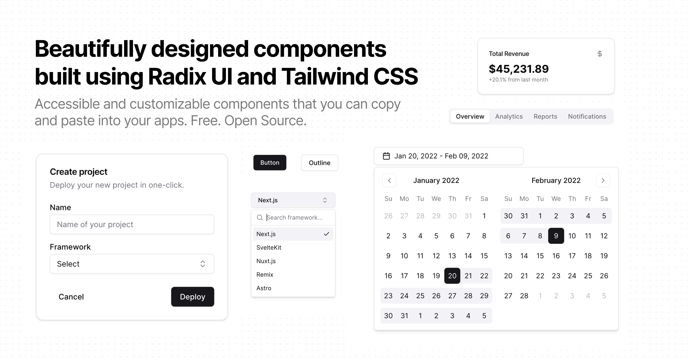

# manfromexistence/auth

Component fells odd in the navbar - if possible then will put anything else there.

Accessible and customizable authentication components that you can copy and paste into your apps. Free. Open Source. **Use this to build your own component library**.

## Documentation

Visit http://manfromexistence-auth.vercel.app/docs to view the documentation.

## Contributing

Please read the [contributing guide](/CONTRIBUTING.md).

## License

Licensed under the [MIT license](https://github.com/manformexistence/auth/blob/main/LICENSE.md).
